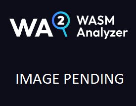

The WASM Analyzer *Package Registry* is accessible via the *Open Package Registry* button1 on the start page, and as a navigation item2 in the main WASM Analyzer interface sidebar. The Package Registry displays a list of WebAssembly *packages* from a given *repository*. Read more about packages in our [WebAssembly documentation](/wasm/), [here](/wasm/concepts-and-features/4-wit#wit-packages).

 

*The Open Package Registry button*

*The Package Registry*

 

 

---

 

## Package Registry address field 

 

In the Package Registry header section, you'll find an address field:

*The Package Registry address field*

 

The default address for this field is:

`https://preview-registry.bytecodealliance.org`

 

:::note[The Bytecode Alliance]

The preset repository address goes to the [ByteCode Alliance](https://bytecodealliance.org/) package preview repository.

:::

 

 

To fetch a list of packages from a different repository, enter the address of a valid WebAssembly package repository into the address field and press the `enter` key, `tab` out of the address field, or click somewhere else on the page.

If you've entered a valid address to a WASM package repository, the page will update with a the package list from your selected repository. You may empty the address field to reload a list from the ByteCode Alliance package preview repository.

 

 

---

 

## Package Registry search function

 

Above the package list, you'll find the search bar:

 

*The Package Registry search bar*

 

The search bar contains a *search filter* button1, and a *search field*2: 

 

*The Package Registry filter button and search field*

 

 

---

 

### Basic search

 

To run a basic search for package names matching a specific package name search query, click on the search field. Type in a search word and press the `enter` key, `tab` out of the search field, or click elsewhere on the page. After you initiate a search, the list will update with a set of search results matching your query. If no matches are available, the list will be emtpy.

 

 

---

 

### Filter list

 

To filter the package list by various package attributes, you can click the *filter* button to access a dropdown with the filter menu:

 

*The Package Registry search filter*

 

The search filter has three tabs. The tabs are *By category*, *By license*, and *By author*.

 

 

#### By category tab

 

The *By category* tab contains settings for filtering the package list by *Category*:

 

*The Package Registry search filter `By category` tab*

 

Enter a valid category name into the *category* field, and press the `enter` key, to add that category to a list of one or more category *tags*.

 

![Category *tag* list]../images/(placeholder.png)
*The Package Registry search filter category tag list*

 

 

#### By license tab

 

The *By license* tab contains settings for filtering the package list by *License*:

 

*The Package Registry search filter `By license` tab*

 

Select one or more licenses from the *license* checklist:

 

*The Package Registry search filter license checklist*

 

 

#### By owner tab

 

The *By author* tab contains settings for filtering the package list by *Author*:

 

*The Package Registry search filter `By author` tab*

 

Select one or more authors from the *Author* checklist:

 

*The Package Registry search filter Author checklist*

 

 

#### Loading the Search filter results

 

Once you've completed your search filter settings, press the *Apply*1 button to update the Package Registry list as per your search filter settings. Use the *Cancel*2 button to unset the filter and keep the currently loaded package list:

 

*The Package Registry search filter buttons*

 

 

---

 

## Package Registry list items

 

Each package in the list is represented by a *card*:

 

*A Package Registry card*

 

 

The left part of the card contains the following Metadata, if available:

| name                         | explanation                                                                                            |
| ---------------------------- | ------------------------------------------------------------------------------------------------------ |
| *Name*1           | Published name of the package: `Click` on this field to enter the *Metadata* view for this package.    |
| *Version*2        | Latest published *version* of the package                                                              |
| *Component type*3 | *Component* type of the package; Possible values: `Component`, `Interface`, or `Module`                 |
| *Description*4    | Package description                                                                                    |
| *Homepage*5       | Homepage `link`                                                                                        |
| *Documentation*6  | Documentation `link`                                                                                   |
| *Repository*7     | Repository `link`                                                                                      |
| *Category* tags8  | List of meta categories; A `tag` list                                                                  |

 

*Package Registry card, right side*

 

 

The right part of the card contains the following:

| name                         | explanation                                                                     |
| ---------------------------- | ------------------------------------------------------------------------------- |
| *Latest Release*1 | *Publishing date* of the latest *version* of the package                        |
| *Releases*2       | Number of released *versions* of the package                                    |
| *Size*3           | Package size in *bytes*, displayed as *kilobytes*/*megabytes* as appropriate    |
| *Author*4         | List of one or more package authors, including email address if available       |
| *License*5        | Representation of the license, or licenses, the package falls under             |

 

*Package Registry card, left side*

 

 

---

 

## Summary

 

- The Package Registry is accessible from the *Open Package Registry* button, on the WASM Analyzer start page, or from the *Package Registry* tab once you've loaded a *.wasm* file, or a *package* from the Package Registry list.
- A list of packages from a different package *package repository* may by fetched, by entering a repository address in the *address field*. 
- The Package Registry can be *searched* or *filtered* using the **search bar**.
- Packages are represented as *cards* that contain some of the available *metadata* for a given package.
- Clicking on a *package* name in the list leads to a more detailed *Metadata view*, for that package.

 

 

### **Additional reading**

- [Nor2 on _WebAssembly_](/wasm/)