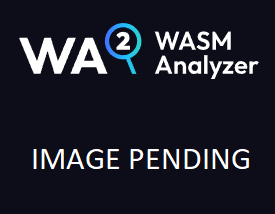

You'll reach the *Exports* page by clicking the *Exports* navigation item on the WASM Analyzer sidebar. On the Exports page, you find information about exports the WebAssembly file exposes, if any. At the top of the Exports page, you find a summary of the following:

* Exported Functions1
* Exported Tables2
* Exported Memories3
* Exported Globals4

 

*The summary section*.

 

Clicking one of the summary items above takes you to the top of the related table.

 

You can read more about WebAssembly exports in the [Exports section](/wasm/building-blocks/2-exports) of our WebAssembly overview.

Below the summary, you find lists in sections representing those export statements that are present in the *.wasm* file, or package.

 

 

---

 

## Exports search function

 

Above the Export lists, you'll find the search bar:

 

*The Exports search bar*

 

Read on for information about how to run a search.

 

 

---

 

### Basic Search

 

To run a basic search for Export names, or Module names matching a specific name search query, click on the *search field*. Type in a search word and press the `enter` key, `tab` out of the search field, or click elsewhere on the page. After you initiate a search, the list will update with a set of search results matching your query. If no matches are available, the list will be emtpy.

 

 

---

  

## Lists

The Exports page gives you information about four WebAssembly sections:

* Functions
* Tables
* Memories
* Globals

 

 

### **Functions**

 

You can read more about the functions in the export *Functions* list, in the [Functions section](/wasm/building-blocks/3-functions) of our WebAssembly overview.

 

Columns of the export *Functions* list:

| name                          | purpose                                                                   |
| ----------------------------- | ------------------------------------------------------------------------- |
| *Export*1          | Function name in `string` format                                          |
| *Parameters*2      | [Typed](/wasm/concepts-and-features/1-types) parameters required by *function*    |
| *Result*3          | [Typed](/wasm/concepts-and-features/1-types) *function* output                    |

 

*The exported functions list*

 

The list can by sorted by clicking on the *Export* column header. One click sorts the list in in descending order on the selected column. Clicking the same column again sorts the list according to ascending order. A third click on the same column clears the current sort order and returns the list to its original unsorted state.

 

 

### **Tables**

 

You can read more about the tables in the export *Tables* list, in the [Tables section](/wasm/building-blocks/4-tables) of our WebAssembly overview.

 

Columns of the exports *Tables* list:

| name                     | purpose                                                                     |
| ------------------------ | --------------------------------------------------------------------------- |
| *Export*1     | *Table* name in `string` format                                             |
| *Type*2       | Function type in *table*, possible values: `anyfunc` and `externalref`      |
| *Minimum*3    | Initial `number` of items, and minimum `number` of items in *table*         |
| *Maximum*4    | Maximum `number` of items in *table*                                        |

 

*The exported tables tab*

 

The list can by sorted by clicking on the *Export*, or *Type* column headers. One click sorts the list in in descending order on the selected column. Clicking the same column again sorts the list according to ascending order. A third click on the same column clears the current sort order and returns the list to its original unsorted state.

 

 

### **Memories**

 

You can read more about the memories in the export *Memories* list, in the [Memories section](/wasm/building-blocks/5-memories) segment of this documentation.

 

Colummns of the export *Memories* list:

| name                          | purpose                                                                                                    |
| ----------------------------- | ---------------------------------------------------------------------------------------------------------- |
| *Export*1          | *Memory* field name in `string` format                                                                     |
| *Thread Sharing*2  | If shared *memory* (a `SharedArrayBuffer`) or not (an `ArrayBuffer`), possible values: `true` and `false`  |
| *Minimum*3         | Minimum memory size in *bytes*, displayed as *kilobytes*/*megabytes* as appropriate                        |
| *Maximum*4         | Maximum memory size in *bytes*, displayed as *kilobytes*/*megabytes* as appropriate                        |

 

*The exported memories list*

 

The list can by sorted by clicking on the *Export* column header. One click sorts the list in in descending order on the selected column. Clicking the same column again sorts the list according to ascending order. A third click on the same column clears the current sort order and returns the list to its original unsorted state.

 

 

### **Globals**

 

You can read more about the globals in the export *Globals* list, in the [Globals section](/wasm/building-blocks/6-globals) segment of this documentation.

 

Columns of the export *Globals* list:

| name                          | purpose                                                             |
| ----------------------------- | ------------------------------------------------------------------- |
| *Export*1          | *Global* variable field name in `string` format                     |
| *Type*2            | [Type](/wasm/concepts-and-features/1-types) of the *global* variable            |
| *Mutable*3         | If *global* is **mutable**, possible values are `true` and `false`  |

 

*The export globals list*.

 

The list can by sorted by clicking on the *Export*, or *Type* column headers. One click sorts the list in in descending order on the selected column. Clicking the same column again sorts the list according to ascending order. A third click on the same column clears the current sort order and returns the list to its original unsorted state.

 

 

---

 

## Summary

- The *Exports* page can be accessed by clicking the *Exports* `navigation item` in the WASM Analyzer sidebar.
- The *Exports* page shows information about imported *functions*, *tables*, *memories* and *globals*.
- The *Exports* lists are searchable and sortable.

 

 

### **Additional reading**

- [Nor2 on _WebAssembly_](/wasm/)

