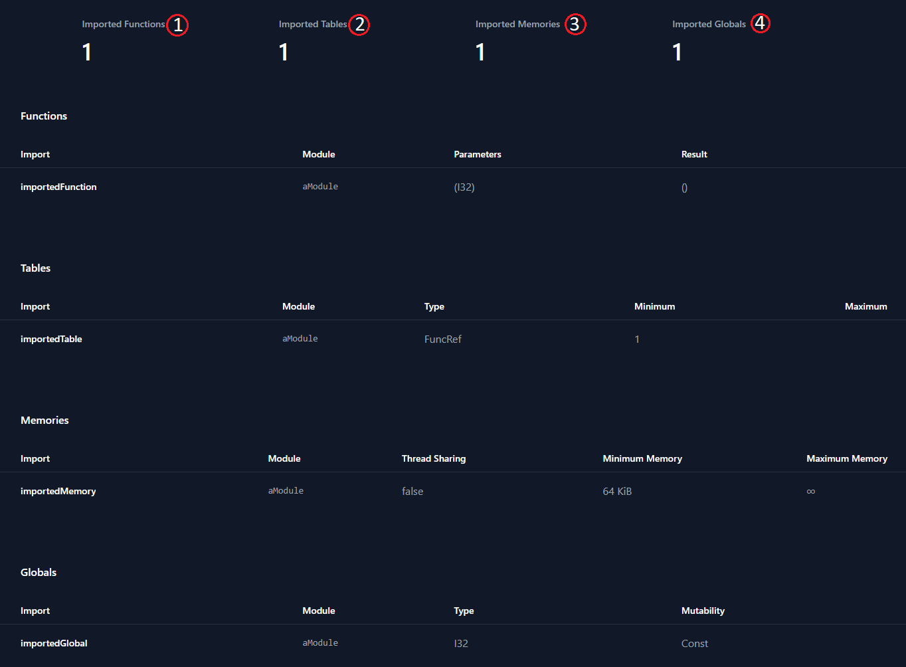
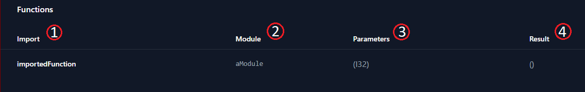
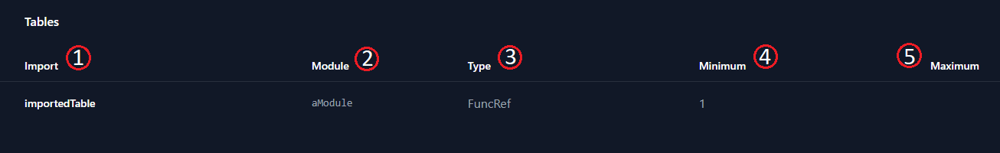
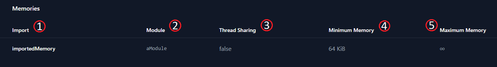
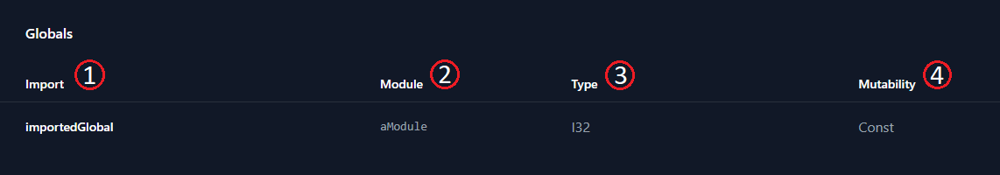

You'll reach the *Imports* page by clicking the *Imports* navigation item on the WASM Analyzer sidebar. On the Imports page, you find information about imports the WebAssembly file requires, if any. At the top of the Imports page, you find a summary of the following:

* Imported Functions1
* Imported Tables2
* Imported Memories3
* Imported Globals4

 

Clicking one of the summary items above takes you to the top of the related table.

 

*The summary section*.

 

You can read more about WebAssembly imports in the [Imports section](/wasm/building-blocks/1-imports) of our WebAssembly overview.

Below the summary, you find lists in sections representing those import statements that are present in the *.wasm* file, or package.

 

 

---

 

## Imports search function

 

Above the Imports list, you'll find the search bar:

 

*The Imports search bar*

 

 

---

 

### Basic Search

 

To run a basic search for Import names, or Module names matching a specific name search query, click on the *search field*. Type in a search word and press the `enter` key, `tab` out of the search field, or click elsewhere on the page. After you initiate a search, the list will update with a set of search results matching your query. If no matches are available, the list will be emtpy.

 

 

---

  

## Lists

The Exports page gives you information about four WebAssembly sections:

* Functions
* Tables
* Memories
* Globals

 

 

### **Functions**

 

You can read more about the functions in the import *Functions* list, in the [Functions section](/wasm/building-blocks/3-functions) of our WebAssembly overview.

 

Columns of the import *Functions* list:

| name                     | purpose                                                                             |
| ------------------------ | ----------------------------------------------------------------------------------- |
| *Import*1     | *Function* name in `string` format                                                  |
| *Module*2     | Module the *function* is imported from, `Link` to *Metadata overview* for Module    |
| *Parameters*3 | [Typed](/wasm/concepts-and-features/1-types) parameters required by *function*      |
| *Result*4     | [Typed](/wasm/concepts-and-features/1-types) *function* output                      |

 

*The imported functions list*

 

The list can by sorted by clicking on the *Import*, or *Module* column headers. One click sorts the list in in descending order on the selected column. Clicking the same column again sorts the list according to ascending order. A third click on the same column clears the current sort order and returns the list to its original unsorted state.

 

 

### **Tables**

 

You can read more about the tables in the import *Tables* list, in the [Tables section](/wasm/building-blocks/4-tables) of our WebAssembly overview.

 

Columns of the import *Tables* list:

| name                     | purpose                                                                  |
| ------------------------ | ------------------------------------------------------------------------ |
| *Import*1     | *Table* name in `string` format                                          |
| *Module*2     | Module *table* is imported from, `Link` to Module *Metadata overview*    |
| *Type*3   | Function type in *table*, possible values: `anyfunc` and `externalref`   |
| *Minimum*4    | Initial `number` of items, and minimum `number` of items in *table*      |
| *Maximum*5    | Maximum `number` of items in *table*                                     |

 

*The imported tables list*

 

The list can by sorted by clicking on the *Import*, *Module*, or *Type* column headers. One click sorts the list in in descending order on the selected column. Clicking the same column again sorts the list according to ascending order. A third click on the same column clears the current sort order and returns the list to its original unsorted state.

 

 

### **Memories**

 

You can read more about the memories in the import *Memories* list, in the [Memories section](/wasm/building-blocks/5-memories) of our WebAssembly overview.

 

Colummns of the import *Memories* list:

| name                          | purpose                                                                                                    |
| ----------------------------- | ---------------------------------------------------------------------------------------------------------- |
| *Import*1          | *Memory* field name in `string` format                                                                     |
| *Module*2          | Module the *memory* is imported from, `Link` to *Metadata overview* for Module                             |
| *Thread Sharing*3  | If shared *memory* (a `SharedArrayBuffer`) or not (an `ArrayBuffer`), possible values: `true` and `false`  |
| *Minimum*4         | Minimum memory size in *bytes*, displayed as *kilobytes*/*megabytes* as appropriate                        |
| *Maximum*5         | Maximum memory size in *bytes*, displayed as *kilobytes*/*megabytes* as appropriate                        |

 

*The imported memories list*

 

The list can by sorted by clicking on the *Import*, or *Module* column headers. One click sorts the list in in descending order on the selected column. Clicking the same column again sorts the list according to ascending order. A third click on the same column clears the current sort order and returns the list to its original unsorted state.

 

 

### **Globals**

 

You can read more about the globals in the import *Globals* list, in the [Globals section](/wasm/building-blocks/6-globals) of our WebAssembly overview.

 

Columns of the import *Globals* list:

| name                          | purpose                                                                          |
| ----------------------------- | -------------------------------------------------------------------------------- |
| *Import*1          | *Global* variable field name in `string` format                                  |
| *Module*2          | Module the *global* is imported from, `Link` to *Metadata overview* for Module   |
| *Type*3            | [Type](/wasm/concepts-and-features/1-types) of the *global* variable             |
| *Mutable*4         | If *global* is **mutable**, possible values: `true` and `false`                  |

 

*The imported globals list*

 

The list can by sorted by clicking on the *Import*, *Module*, or *Type* column headers. One click sorts the list in in descending order on the selected column. Clicking the same column again sorts the list according to ascending order. A third click on the same column clears the current sort order and returns the list to its original unsorted state.

 

 

---

 

## Summary

- The *Imports* page can be accessed by clicking the *Imports* `navigation item` in the WASM Analyzer sidebar.
- The *Imports* page shows information about imported *functions*, *tables*, *memories* and *globals*.
- The *Imports* lists are searchable and sortable.

 

 

### **Additional reading**

- [Nor2 on _WebAssembly_](/wasm/)
