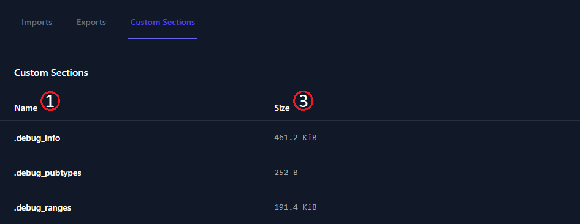

The WASM Analyzer *Custom Sections* page is accessible as a navigation item in the WASM Analyzer navigation menu. The navigation item is only clickable if the *.wasm* file or package contains one or more Custom Section. The Custom Sections list displays a representation of the available *Custom Sections* in a given *.wasm* file, or package. You can read more about custom sections in the [Custom sections](/wasm/building-blocks/7-custom-sections/) part of our WebAssembly overview documentation.

 

*The Custom Sections view*

 

 

---

 

## Custom Sections search function

 

Above the Custom Sections list, you'll find the search bar:

 

*The Custom Sections search bar*

 

 

---

 

### Basic Search

 

To run a basic search for Custom Section names matching a specific name search query, click on the *search field*. Type in a search word and press the `enter` key, `tab` out of the search field, or click elsewhere on the page. After you initiate a search, the list will update with a set of search results matching your query. If no matches are available, the list will be emtpy.

 

 

---

##  The Custom Sections list

 

In the *Custom sections* list, you'll find a list of custom sections.

The *Custom sections* list has the following columns:

| name                          | purpose                                                                                |
| ----------------------------- | -------------------------------------------------------------------------------------- |
| *Name*1            | Custom section name in `string` format                                                 |
| *Description*2     | A description of the purpose of the Custom Section, for *known* custom sections only   |
| *Size*3            | Size in *bytes*, displayed as *kilobytes*/*megabytes* as appropriate                   |

 

*The Custom Sections list*.

 

 

The list can by sorted by clicking on the *Name*, or *Size* column headers. One click sorts the list in in descending order on the selected column. Clicking the same column again sorts the list according to ascending order. A third click on the same column clears the current sort order and returns the list to its original unsorted state.

 

 

---

 

## Summary

 

- The *Custom Sections* page can be accessed by clicking the *Custom Sections* `navigation item` in the WASM Analyzer sidebar.
- The *Custom Sections* page shows a list of *Custom Sections* inside of a WebAssembly file, or package.
- The *Custom Sections* list is searchable and sortable.

 

 

### **Additional reading**

- [Nor2 on _WebAssembly_](/wasm/)