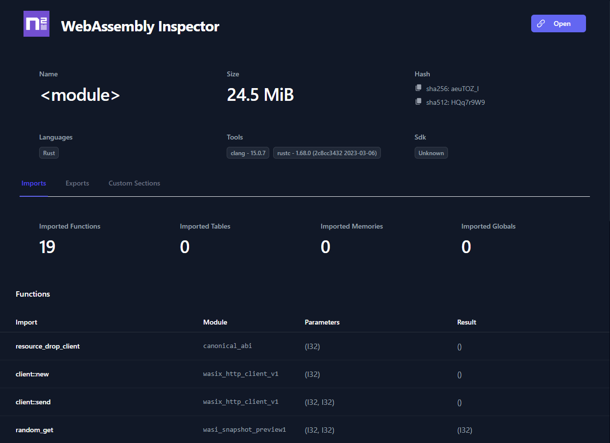
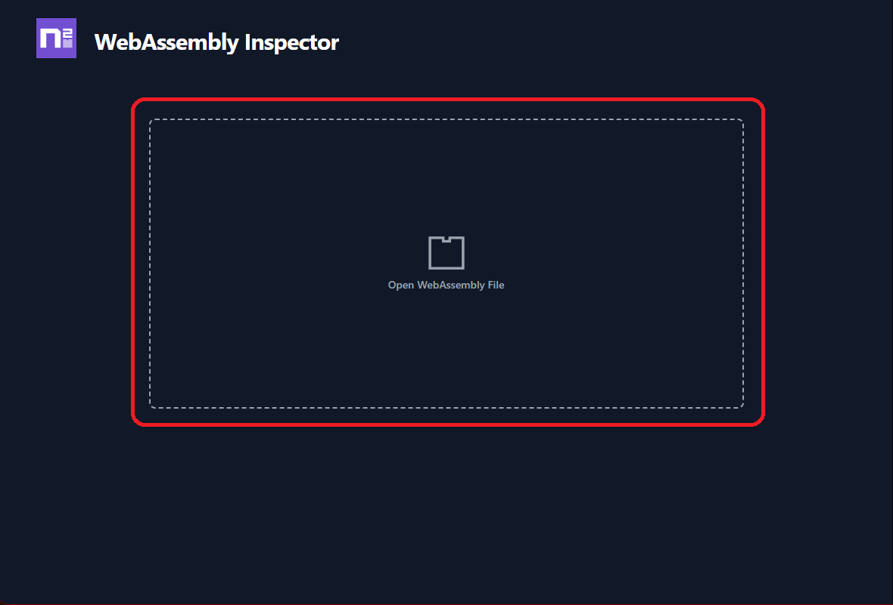
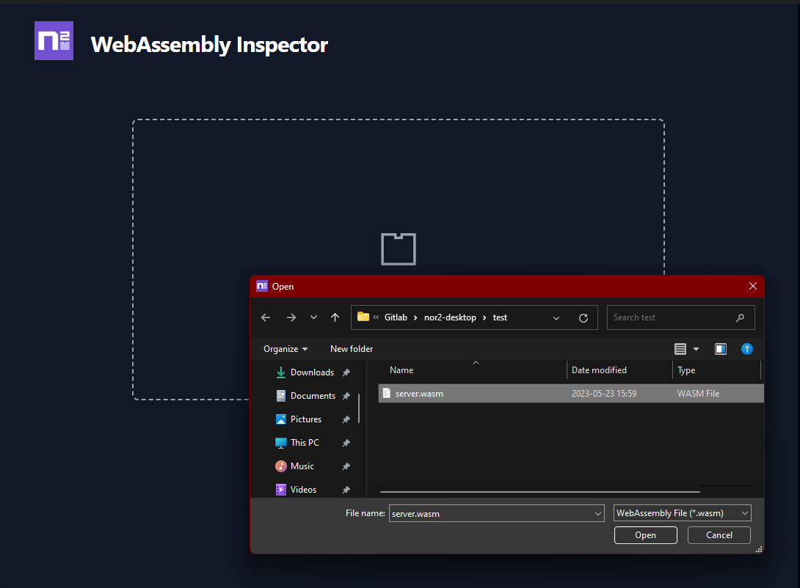
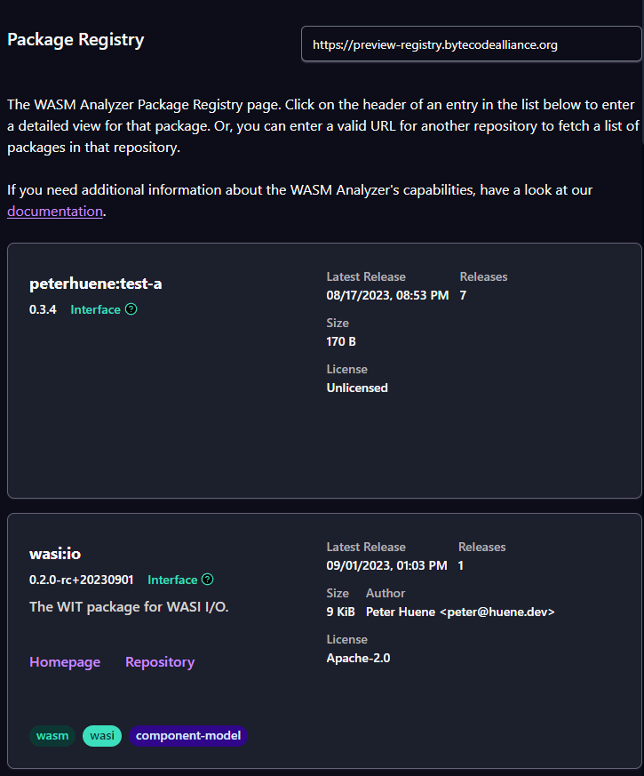
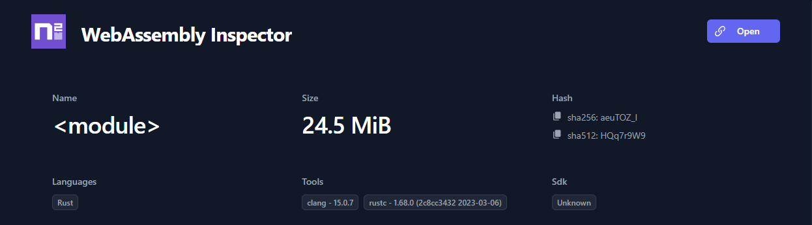
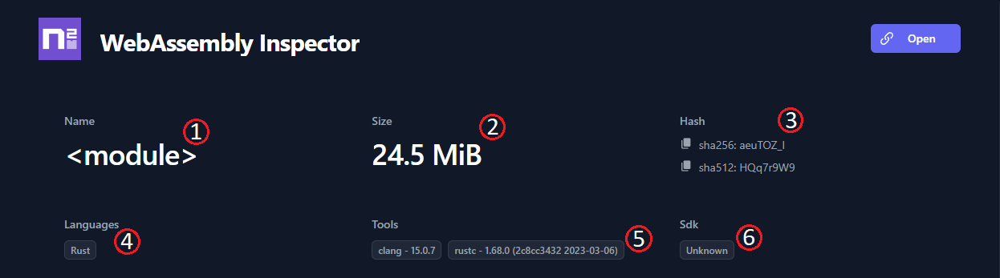
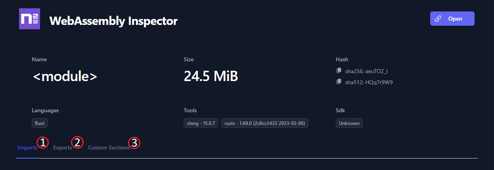

Let's have a look at the Nor2 WASM Analyzer: In a simple, user-friendly interface, we provide you with the means to get an overview of your WebAssembly files and packages. Where previously you might have had to go through a convoluted process involving a few tools or converting your .wasm files to a different format in order to get information about its properties, we'll now be doing the job for you, providing you with easy-to-read information in a simple, but effective, unified interface.

Primarily, The _WASM Analyzer_ came about as the solution to a problem we've seen with the WebAssembly ecosystem—It is occasionally very hard to find information about the capabilities of a WebAssembly file. With the WASM Analyzer, anyone will be able to find information about the Imports, Exports and other properties of a given module or component, without having to use more than one tool or having to do any kind of file conversion or data extraction from a given file.

In giving the WASM Analyzer to the community, we also hope to encourage WebAssembly developers to think about adding more useful information to modules or components.

 

 

:::caution[WIP]

This documentation is still WIP and images need to be updated to reflect the current state of the tool.

:::

 

 

_The Nor2 WASM Analyzer Metadata overview_

 

 

---

 

## Key features

The WASM Analyzer allows for two entry paths: You can either elect to browse for a WebAssembly .wasm file and open it, or you can open the Package Registry page, and pick a package to view from a given repository.

 

### Working with .wasm files

- First, you load up a _.wasm_ file you want to inspect, from the [start page](#getting-started-with-a-selected-wasm-file).
- Now, you'll find yourself on the WASM Analyzer [Metadata page](#landing-on-the-metadata-page).
- In the Metadata overview and Registry Metadata sections in the **Metadata** overview, you'll find representations of the various metadata attributes of the file.
- In the navigation sidebar, you'll find various navigation items. Clicking on these navigation items leads to more [pages](#pages), allowing you to view and work with specific aspects of the _.wasm_ file or package.

 

### Working with the Package Registry

- First, you click on the Package Registry button, on the [start page](#getting-started-with-the-package-registry).
- Now, you'll find yourself on the Package Registry page.
- If you want to view a list of packages from a different package _repository_, change the address in the address box.
- Search and filter packages using the filter option.

 

 

---

 

## Getting started with a selected .wasm file

 

To get started, it's as easy as clicking on the _Browse WASM file_ button:

_The Browse WASM file button_

 

From here, you can browse to and select a .wasm file you want to inspect:

_Find your .wasm file through the file browser_

 

 

---

 

## Getting started with the Package Registry

 

To get started, click on the :

_The Open Package Registry button_

 

From here, you can select a WebAssembly package you want to inspect:

_Pick a WebAssembly package from the Package Registry list_

 

 

---

 

## Landing on the Metadata page

Once you've picked a file you want more information about, you'll find yourself on the Metadata page:

_The Metadata page_

 

 

### The Metadata overview

In the Metadata overview, you'll find general information about your .wasm file:

_General WebAssembly package information on the WASM Analyzer Meta overview_

 

You'll be provided with a representation of the available metadata in your selected file or package. This information may include data such as the name1, size2 (in bytes), and base64 representations of the _.wasm_ file hashes3 in sha256 and sha512 formats. Furthermore, you may find information about which programming language4 the item is based on, as well as the tools5 used to build it, and any SDK6 it was built on, if such information is available:

_File information, explanation_

 

 

---

 

### Pages

You'll find additional information and functionality for working with the _.wasm_ file or package you've loaded, represented by navigation items on the sidebar.

Currently, the WASM Analyser has the following pages:

| name               | contents                                                                                                                                             | additional info                                    |
| ------------------ | ---------------------------------------------------------------------------------------------------------------------------------------------------- | -------------------------------------------------- |
| _Package Registry_ | List of packages in a given repository                                                                                                               | [**Package Registry**](/actions/registry)          |
| _Show WAT_         | View where you can inspect and download a WebAssembly Text representation of your _.wasm_ file, or package                                           | [**Show WAT**](/actions/wat)                       |
| _Imports_          | Summary and lists of [imported](/wasm/1-imports) _functions_, _tables_, _memories_ and _globals_                                                     | [**Imports**](/core-wasm/imports)                  |
| _Exports_          | Summary and lists of [exported](/wasm/2-exports) _functions_, _tables_, _memories_ and _globals_                                                     | [**Exports**](/core-wasm/exports)                  |
| _WIT Inspection_   | View for inspecting a WebAssembly Interface Text representation of a _.wasm_ file, or package                                                        | [**WIT Inspection**](/component-model/wit)         |
| _Components_       | Summary of the _components_ of a package or _.wasm_ file following the [WebAssembly Component model](/wasm/concepts-and-features/4-component-model)  | [**Components**](/component-model/components)      |
| _Dependencies_     | Summary of the _dependencies_ of your package or _.wasm_ file                                                                                        | [**Dependencies**](/component-model/dependencies)  |
| _Custom Sections_  | List of the Custom Sections in a _.wasm_ file or package                                                                                             | [**Custom Sections**](/custom-sections/)           |

 

_WASM Analyzer sidebar_

 

:::note[Not all navigation items are clickable all the time]

Some navigation items in the WASM Analyzer are only clickable if there are relevant entries for the WebAssembly module or component.

:::

 

 

---

 

## Summary

The WASM Analyzer is a new tool. This tool provides users with insights into the functionality and contents of a given WebAssembly file. The WASM Analyzer gives users an overview of the contents of a given module or component, including such properties as WIT definitions.

### **Additional reading**

- [Nor2 on _WebAssembly_](/wasm/)
- [Nor2 on _DWARF debugging information_](/debugging/dwarf)
- The Nor2 front page: https://nor2.io/
